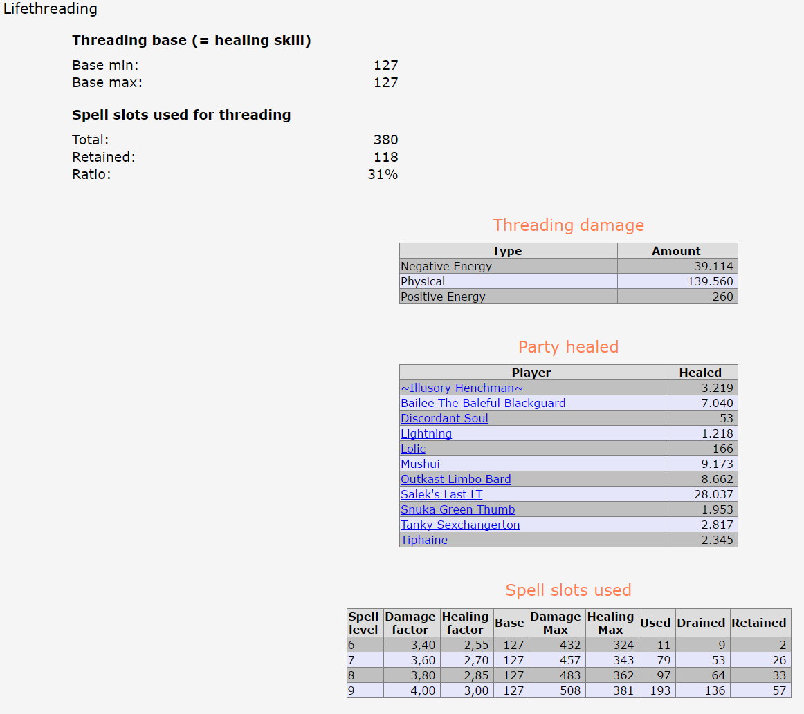
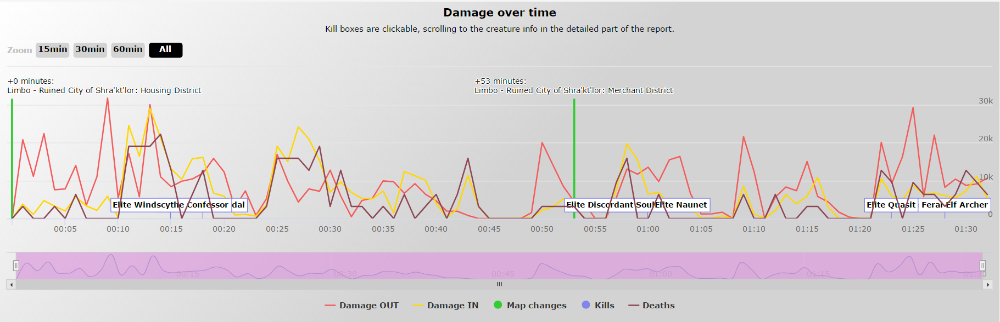

### Introduction

You have to enable javascript to get the most out of these run reports.

The files in the HTML/js folder are unmodified ones taken from
  - <a href="https://jquery.com/">jQuery</a>
  - <a href="https://www.highcharts.com/">Highcharts</a>
  - <a href="https://github.com/Mottie/tablesorter">tablesorter</a>

The report files themselves are only containing small amounts of embedded javascript code to add some functionality to few tables and to enable navigation.

In case you are scared either

  - have a look at the HTML and javascript files on GitHub (click the blue 'View on Github' on top of the screen) and examine the files in the HTML folder and below  prior to enabling javascript and/or

  - run a 'sandboxed' browser

Loading the HTML files takes a few seconds (typically up to 15-20 seconds), these are up to 3MB in size and the javascript formatting of the many tables is somehow time expensive.

Most of the table columns can be sorted by clicking on the header:

 
### Runs

#### Limbo
  - P1
    - <a href="html/2016-04-16T153328 - Limbo P1 - Salek's Last LT.html">Limbo P1 run with lifethreader</a> (comparing threader damage to BG)

    - <a href="html/2017-07-11T110752 - Limbo P1 - Salek's Last Herald.html">Limbo P1 run with herald</a> (herald of storms in Limbo - very first Limbo run ever, 2 days after Limbo came in)

  - P2
    - Don't have any logs to create reports from

#### Abyss

#### Hell

  - Stygia
    - <a href="html/2016-02-06T171051 - Stygia - Salek's Last Slinger.html">Level 80 Slinger</a> (damage and damage per hit of a level 80 slinger)

#### Elysium

#### Aboleths

#### Miscellaneous
  - PLACEHOLDER (comparing damages: slinger to AA)

 
### Some screenshots

**Run summary**

* * *

**Damage OUT detailed**
* * *

**Lifethreading**

**Various tables**

**Save checks**

**Damage over time**

**Character statistics (header)**

